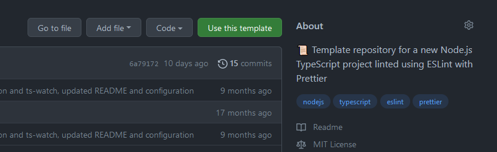

# Programmer le Cloud
{: .no_toc }


[xkcd](https://xkcd.com/1319/)

1. TOC
{:toc}

## Objectifs

Ce cours est l'occasion de vous initier aux pratiques DevOps, qui consistent à rapprocher le développement et l'administration système : "*You build it, you run it*".

À l'issue du mini-projet, vous serez capable de créer une image Docker pour une application web, testée et déployée de manière continue dans le cloud.

## Prérequis

Pour mener à bien ce mini-projet, vous devrez vous appuyer sur les services gratuits de plusieurs fournisseurs. Ainsi, il vous faudra créer :

* un compte [GitHub](https://github.com/) pour héberger votre dépôt et réaliser l'intégration et la livraison continues ;
* un compte [Docker Hub](https://hub.docker.com/) pour publier l'image Docker de votre application ;
* un compte [Fly.io](https://fly.io/), enfin, qui vous servira à déployer l'application sur leur offre *Platform-as-a-Service*.

> **Note**
> Alternatives to Fly.io : 
> Vous pouvez également visiter [Railway](https://railway.app) ou [Render](https://render.com), qui sont des plateformes similaires.
> En fonction de leur évolution, un plan gratuit devrait toujours être disponible.

Pour ne pas perdre de temps : si ce n'est pas déjà fait, créez ces comptes immédiatement. Notamment chez Fly.io, il peut y avoir une latence entre la demande de création de compte et sa validation.

Pour développer localement, sur votre machine, il vous faudra installer :

* [Node.js](https://nodejs.org/en/) (version LTS, 16 actuellement) ;
* [Docker](https://docs.docker.com/get-docker/) ;
* [flyctl](https://fly.io/docs/hands-on/install-flyctl/).

Les procédures d'installation seront données lorsque nécessaire, au fur et à mesure du sujet.

N'hésitez pas à travailler dans une machine virtuelle. Si vous utilisez Windows 10, le sous-système Linux pour Windows (*WSL*) est une bonne solution, notamment car il fonctionne particulièrement bien avec l'IDE de Microsoft, Visual Studio Code :

* [Installer WSL 2 -- Microsoft Docs](https://docs.microsoft.com/fr-fr/windows/wsl/install)

Si vous travaillez sur une machine de salle informatique, vous pouvez créer une VM VirtualBox à partir d'[une image disque Ubuntu Server 20.04.3](https://sourceforge.net/projects/osboxes/files/v/vb/59-U-u-svr/20.04/20.04.3/64bit.7z/download). Pour cette VM, le login est "osboxes", le mot de passe "osboxes.org". Attention, le clavier est par défaut en qwerty, il faut donc taper "osboxes:org" sur un clavier français. Utilisez ensuite la commande `sudo loadkeys fr` pour passer en azerty.

Les instructions du TD seront données pour Ubuntu 20.04 (qui est notamment la distribution par défaut pour WSL2). **Vous êtes responsable de votre environnement de développement** : si vous n'êtes pas certain-e de le maîtriser, alignez-vous sur ce choix, qui vous permettra de gagner du temps sur les aspects opérationnels du sujet.

## Évaluation

Vous restituerez ce mini-projet en produisant une archive contenant tous les fichiers que vous jugerez utile de fournir, ainsi qu'un compte-rendu comportant vos réponses aux questions qui seront posées tout au long du sujet, et toute remarque ou commentaire que vous souhaiteriez ajouter.

La dernière séance de TD sera l'occasion de faire une courte démonstration de votre travail : préparez-vous bien, et n'hésitez surtout pas à poser vos questions par mail en amont.

## TD1 : une application Node.js

### Objectif

Dans ce premier TD, nous allons développer une micro-application pour **Node.js**. Elle sera écrite en **TypeScript**.

TypeScript est un sur-ensemble de JavaScript, développé par Microsoft et distribué sous licence Apache, qui permet le typage strict (pas de conversion implicite entre les types, pas de comportement inattendu des opérateurs) et statique (détection d'erreurs de programmation dès la compilation, pas d'état illégal durant l'exécution) des variables, l'utilisation de classes et d'interfaces ainsi que le découpage du code en modules, l'équivalent des espaces de noms en C++. Le code TypeScript est transpilé vers JavaScript avant son déploiement -- les sources sont vérifiées puis transformées en JavaScript par le compilateur : il ne s'agit pas d'une opération de compilation d'un code source vers du code machine, mais de source à source.

Node.js est un runtime pour JavaScript, c'est-à-dire une machine virtuelle qui fournit l'environnement d'exécution pour le langage. Node.js permet d'exécuter du code JavaScript côté serveur, et fournit dans sa bibliothèque standard un ensemble de primitives système. Node.js est livré avec `npm`, son gestionnaire de paquets, qui autorise l'installation et la gestion des dépendances d'une application.

La configuration d'un projet TypeScript demande un peu de travail préalable, c'est pourquoi vous partirez d'un projet dit *template* disponible sur GitHub. Vous créerez votre propre dépôt pour l'application à partir de ce template, via le bouton *"Use this template"* :



Votre application devra être accessible par le web et capable de donner des informations concernant le système sur lequel elle s'exécute : nombre de cœurs de processeur et charge actuelle, quantité de mémoire disponible et utilisée, version du système d'exploitation, etc.

La fonctionnalité attendue est la suivante :

* L'application écoute sur un port quelconque et répond aux requêtes HTTP sur un chemin précis (`http://localhost/api/v1/sysinfo`) ;
* Pour ce chemin, on retourne un objet (sérialisé en JSON) de la forme suivante :

  ```typescript
    interface ISystemInformation {
      cpu: si.Systeminformation.CpuData;
      system: si.Systeminformation.SystemData;
      mem: si.Systeminformation.MemData;
      os: si.Systeminformation.OsData;
      currentLoad: si.Systeminformation.CurrentLoadData;
      processes: si.Systeminformation.ProcessesData;
      diskLayout: si.Systeminformation.DiskLayoutData[];
      networkInterfaces: si.Systeminformation.NetworkInterfacesData[];
    }
  ```

* Pour tout autre chemin, on retournera une erreur 404.

### Déroulé

0. Mettez en place votre environnement de travail :
    - Créez votre dépôt GitHub à partir du [template fourni](https://github.com/khannurien/i-want-typescript) ;
    - [Installez Node.js](https://www.digitalocean.com/community/tutorials/how-to-install-node-js-on-ubuntu-20-04-fr) sur votre machine ;
    - Lisez le `README` fourni dans le template et réalisez les étapes nécessaires pour exécuter le code d'exemple, puis les tests unitaires associés.

1. Que pouvez-vous dire sur le fichier `package.json` ? Sur le fichier `package-lock.json` ?

2. Installez avec `npm` la bibliothèque `systeminformation`. Quel impact cette opération a-t-elle sur votre dépôt Git ? Dans `package.json`, quelle différence y a-t-il entre `dependencies` et `devDependencies` ?

3. Écrivez l'application. Un soixantaine de lignes de code sont suffisantes à son fonctionnement : ne cherchez pas à généraliser. Découpez votre code en quelques fonctions qui seront simples à tester par la suite. Quelles difficultés avez-vous rencontrées ?

4. Testez le fonctionnement de votre application. Vous pouvez utiliser l'outil `curl`. À votre avis, pourquoi utilise-t-on ce formalisme pour construire l'URL de l'API ?

    ```shell
    curl http://localhost:8000
    curl http://localhost:8000/api/v1/sysinfo
    ```

4. Écrivez un jeu de tests pour votre application avec Jest, et vérifiez son exécution. Pourquoi écrit-on un tel jeu de tests ?

5. *(Facultatif)* Écrivez un jeu de tests pour votre application avec Pact. Le framework fournit un [guide de démarrage](https://docs.pact.io/5-minute-getting-started-guide/) et [un exemple en TypeScript](https://github.com/pact-foundation/pact-js/blob/master/examples/typescript/test/get-dog.spec.ts). Quelle(s) différence(s) identifiez-vous entre vos deux jeux de tests ?

## TD2 : conteneurisation avec Docker

### Objectif

Ce second TD introduit la notion d'**image** et de **conteneur** avec **Docker**. L'idée est de déporter l'exécution de votre application dans un processus isolé du reste du système. Ce processus sera initialisé à partir d'une image disque qui contiendra l'ensemble des dépendances nécessaires à l'exécution.

Un conteneur est un mécanisme d'isolation léger qui s'appuie sur le noyau du système d'exploitation hôte. Du point du vue du programme qui s'y exécute, la plateforme semble être un système complet. Néanmoins, les ressources qui lui sont allouées constituent un sous-ensemble virtualisé des ressources disponibles sur la machine hôte.

Docker est en réalité une suite d'outils :
* `dockerd` est un daemon qui fournit une API et une CLI, capable de construire les images, distribuables, qui représentent l'état initial d'un conteneur. C'est l'interface de haut niveau avec laquelle vous allez communiquer dans ce projet ;
* `containerd`, initiative de la CNCF, gère le cycle de vie d'un conteneur (hypervision, exécution avec `runc`) et est responsable de la gestion des images (push, pull), du stockage et du réseau -- c'est-à-dire d'établir un lien entre les namespaces des différents conteneurs ;
* `containerd-shim` est un processus intermédiaire qui restera le processus père d'un conteneur durant toute son exécution. Il maintient la liste des descripteurs de fichiers ouverts par le conteneur (à commencer par `stdio`). Cela permet de maintenir un lien avec le conteneur dans le cas où `containerd` est arrêté. Par ailleurs, il est responsable de remonter le code de sortie d'un conteneur au niveau supérieur ;
* `runc` implémente la [spécification OCI](https://github.com/opencontainers/runtime-spec) et contient le code permettant l'exécution d'un conteneur. Il crée et démarre le conteneur, et termine son exécution.


[Avijit Sarkar](https://medium.com/@avijitsarkar123/docker-and-oci-runtimes-a9c23a5646d6)

Dans l'écosystème Docker, une image correspond à une "recette" décrite dans un fichier, communément nommé `Dockerfile`, qui, au même titre qu'un `Makefile` pour `make` donne une suite d'instructions à la machine pour produire un binaire de l'application, donne ici la marche à suivre pour produire un conteneur qui comprendra l'application et son environnement d'exécution.

Les instructions décrites dans un `Dockerfile` sont exécutées séquentiellement, à l'image de ce que pourrait faire un script shell pour préparer un environnement de travail. Contrairement à un script shell, impératif, le `Dockerfile` fournit une interface plus *déclarative* : certaines instructions masquent une grande complexité.

Lors de la construction de l'image du conteneur, chaque commande du `Dockerfile` produit une "couche" dans le système de fichiers. La couche de base est une distribution Linux, et chacune des instructions ajoute les couches de configuration nécessaires à l'exécution de l'application que l'on souhaite empaqueter.

Vous trouverez l'instruction `FROM` à la première ligne de tout `Dockerfile` : c'est elle qui définit la couche de départ de votre image. Pour construire une image de votre application, vous allez vous appuyer sur la distribution **Alpine Linux**, destinée aux systèmes légers et souvent utilisée dans le contexte de la conteneurisation.

### Déroulé

0. Installez Docker et testez son fonctionnement :
  
    ```shell
    # Ajout à apt de la clef GPG des dépôts officiels Docker
    sudo apt-get update
    sudo apt-get install ca-certificates curl
    sudo install -m 0755 -d /etc/apt/keyrings
    sudo curl -fsSL https://download.docker.com/linux/ubuntu/gpg -o /etc/apt/keyrings/docker.asc
    sudo chmod a+r /etc/apt/keyrings/docker.asc

    # Ajout des dépôts officiels Docker aux sources apt
    echo \
    "deb [arch=$(dpkg --print-architecture) signed-by=/etc/apt/keyrings/docker.asc] https://download.docker.com/linux/ubuntu \
    $(. /etc/os-release && echo "$VERSION_CODENAME") stable" | \
    sudo tee /etc/apt/sources.list.d/docker.list > /dev/null
    sudo apt-get update

    # Installation de la dernière version de Docker
    sudo apt-get install docker-ce docker-ce-cli containerd.io docker-buildx-plugin docker-compose-plugin

    # Vérifier le fonctionnement du daemon (sauf WSL2) :
    sudo systemctl status docker
    ```

    Si vous utilisez WSL2, vous aurez besoin de lancer le daemon à la main :

    ```shell
    sudo dockerd > /dev/null 2>&1 &
    # vérifiez le fonctionnement du daemon :
    sudo docker run hello-world
    ```

    Optionnellement, vous pouvez ajouter l'utilisateur courant au groupe `docker` pour utiliser Docker sans droits superutilisateur (donc sans `sudo` à chaque commande) :

    ```shell
    sudo usermod -aG docker ${USER}
    su - ${USER}
    ```

1. Écrivez votre première image dans un fichier nommé `Dockerfile` à la racine du dépôt de votre application. Voici un squelette de ce fichier, pour vous lancer :

    ```Dockerfile
    # image de départ
    FROM alpine:3.15

    # chemin de travail
    WORKDIR ...

    # installation des paquets système
    RUN ...

    # ajout utilisateur node et groupe node
    RUN ...

    # downgrade des privilèges
    USER ...

    # copie des fichiers du dépôt
    COPY ...

    # installation des dépendances avec npm
    RUN ...

    # build avec npm
    RUN ...

    # exécution
    CMD ...
    ```

    [La documentation](https://docs.docker.com/engine/reference/builder/) fournit des explications détaillées sur les instructions à votre disposition.

2. Créez votre image à partir du `Dockerfile` :

    ```shell
    sudo docker build . -t sysinfo-api:0.0.1
    ```

3. Créez un conteneur à partir de votre image. À quoi sert le flag `-p` ? Le flag `-m` ? Le flag `--cpus` ? Est-ce que faire varier leur valeur a un impact sur la sortie de votre application ? À votre avis, pourquoi ?

    ```shell
    sudo docker run -p 8123:8000 -m1024m --cpus=1 sysinfo-api:0.0.1
    ```

> 💡 Pour vous aider à répondre à cette question, regardez les derniers slides du cours, au sujet de l'isolation des processus sous Linux. Vous pouvez également regarder l'implémentation de la fonction `bocker_run` du [projet `bocker`](https://github.com/p8952/bocker/blob/master/bocker). C'est une implémentation "naïve", très simple, d'un système de conteneurisation semblable à Docker. Vous pouvez y voir les primitives fournies par Linux et utilisées par l'auteur pour réaliser l'isolation des processus (*i.e.* des conteneurs). Que signifient `cgreate` ? `cgset` ? `cgexec` ?

4. Inspectez votre image, d'abord avec la CLI de Docker :

    ```shell
    sudo docker image history sysinfo-api:0.0.1
    ```

    Puis utilisez l'outil `dive` :

    ```shell
    wget https://github.com/wagoodman/dive/releases/download/v0.12.0/dive_0.12.0_linux_amd64.deb
    sudo apt install ./dive_0.12.0_linux_amd64.deb
    dive sysinfo-api:0.0.1
    ```

    Que remarquez-vous ? À votre avis, comment pourrait-on réduire la taille de l'image produite ?

5. Modifiez votre `Dockerfile` pour réaliser une [construction *multi-stage*](https://docs.docker.com/develop/develop-images/multistage-build/) afin d'obtenir une image finale la plus légère possible, que vous taggerez à la version **0.0.2**. Cette image ne devra contenir que les dépendances nécessaires à l'exécution de votre application. Quel delta constatez-vous en termes de taille ? Quelle(s) conséquence(s) cela pourrait-il avoir dans le contexte d'une application réelle ?

    ```Dockerfile
    # stage compilation
    FROM alpine:3.15 as builder
    # ...

    # stage exécution
    FROM alpine:3.15 as runner
    # ...
    COPY --from=builder --chown=node:node ...
    ```

6. Vous allez maintenant pouvoir publier votre image Docker sur un dépôt (Docker Hub). Commencez par la tagger avec votre nom d'utilisateur (pas le mien :-)) :

    ```shell
    sudo docker tag sysinfo-api:0.0.2 khannurien/sysinfo-api:0.0.2
    ```

    Puis publiez-la :

    ```shell
    sudo docker login
    sudo docker push khannurien/sysinfo-api:0.0.2
    ```

7. Déployez un nouveau conteneur à partir de votre image publiée. Quelle commande utilisez-vous ?

## TD3 : CI/CD avec GitHub

### Objectif

Les opérations d'intégration continue (**CI**, pour *Continuous Integration*) et de livraison continue (**CD**, pour *Continuous Delivery*) sont à la base des pratiques DevOps. L'idée est d'avoir, à tout moment du cycle de vie d'une application, une *codebase* dans un état fonctionnel. Il s'agit, d'une part, de s'assurer qu'aucune régression n'est introduite par une évolution dans le code, et d'autre part, que le produit est toujours en état d'être compilé.

À ces fins, nous allons faire en sorte d'exécuter automatiquement la suite de tests de l'application à chaque *commit* sur le dépôt Git. Si les tests passent au vert, alors l'image Docker de l'application sera elle aussi reconstruite et publiée dans la foulée.

L'environnement d'exécution pour les tests est fourni par GitHub dans le cadre de leur produit *Actions*. C'est un conteneur Docker que vous configurez de manière déclarative, au travers d'un fichier YAML qui décrira l'événement déclencheur, les propriétés de l'environnement d'exécution, les actions à réaliser...

Ces fichiers *action* peuvent être mobilisés dans le cadre d'une composition appelée *workflow* : les actions sont alors déclenchées par l'arrivée d'un événement et exécutées séquentiellement, ce qui permet de décrire des environnements d'exécution complexes. Vous pouvez regarder [l'action *Setup Node*](https://github.com/actions/setup-node) fournie par GitHub.

### Déroulé

0. Suivez [le tutoriel de *GitHub Actions*](https://docs.github.com/en/actions/quickstart) pour écrire votre premier *workflow*.

1. Inspirez-vous du *workflow* que vous avez écrit dans le cadre du tutoriel pour correspondre aux exigences suivantes :

    * lors d'un *push* sur la branche `main` de votre dépôt ;
    * installer Node dans la même version que vous utilisez pour développer ;
    * installer les dépendances de votre application ;
    * compiler l'application et exécuter la suite de tests unitaires.

2. Une fois votre *workflow* écrit, testez-le. Comment vérifiez-vous son fonctionnement ?

3. Relisez la question 6 du TD1. Est-ce que ce TD3 vous permet d'enrichir votre réponse ?

## TD4 : déploiement sur PaaS avec Fly.io

### Objectif

Pour cette dernière étape, nous allons nous intéresser au **déploiement** de notre application, c'est-à-dire sa *mise en production* sur une plateforme cible.

Cette plateforme sera **Fly.io**. En particulier, leur offre *PaaS* propose un tier gratuit pour déployer des applications sous forme de conteneurs sur leur infrastructure.

Vous allez d'abord déployer votre application à la main, afin de vous familiariser avec le processus. Puis, vous ferez en sorte d'automatiser cette dernière étape pour atteindre l'objectif du **déploiement continu** : à chaque modification de votre application, une fois les tests passés, une image Docker sera recréée et déployée chez Fly.io.

### Déroulé

> Des alernatives à Fly.io existent: [Railway](https://docs.railway.app/develop/cli), [Vercel](https://vercel.com/docs/getting-started-with-vercel) ou encore [Render](https://render.com/docs/cli) en font partie.

1. Fly.io fournit un outil en ligne de commande, *flyctl*, qui facilite la connexion aux services, la création d'une application Fly.io, la création de conteneurs sur la plateforme... Commencez par installer cet outil, puis utilisez-le pour vous connecter à votre compte Fly.io et créer une application. Pour cela, appuyez-vous sur [la documentation Fly Docs](https://fly.io/docs/hands-on/install-flyctl/).

2. Fly.io utilise son propre registre pour héberger les images Docker de vos applications, le *Container Registry*. L'outil CLI va vous permettre de vous identifier auprès de ce registre. Suivez [la documentation associée](https://fly.io/docs/flyctl/auth-docker/).

3. Publiez l'image Docker de votre application sur le registre Fly.io. Pour cela, vous pouvez utiliser les commandes `docker` que vous avez découvertes lors du TD2. Attention : vous devez bien préciser, lors de l'appel à `docker push`, l'adresse du registre que vous souhaitez utiliser (en l'occurrence, `registry.fly.io`). Préfixez le nom de votre image avec l'adresse du registre (`docker push [registre]/[image]`).

4. Déployez l'application chez Fly.io à partir de l'image que vous venez de publier en utilisant `flyctl deploy` (cf. la [documentation](https://fly.io/docs/flyctl/deploy/)). Vous allez devoir préciser les flags suivants : `--app` pour le nom de votre application, et `--image` pour l'adresse de votre image Docker.

5. Visitez votre application en vous rendant à son URL dans votre navigateur, ou en utilisant `curl`. Que constatez-vous ? Inspectez les journaux de l'application grâce à `flyctl logs`. Que repérez-vous ? Expliquez brièvement ce qu'il va falloir corriger dans l'application.

6. Appliquez le correctif nécessaire dans le code votre application. À quel(s) point(s) des [recommandations Twelve-Factor App](https://12factor.net/fr/) pouvez-vous relier ce changement ?

7. Déployez et testez à nouveau. Grâce à votre application, que pouvez-vous dire sur la machine qui exécute votre code ? Remarquez-vous des éléments intéressants ? Pensez-vous que la sortie serait similaire si votre application était exécutée dans une machine virtuelle, plutôt que dans un conteneur ?

8. La dernière étape de ce mini-projet consiste à automatiser le déploiement de l'application chez Fly.io dès lors qu'une modification est publiée sur le dépôt Git. Fly.io fournit un [guide à cet effet](https://fly.io/docs/app-guides/continuous-deployment-with-github-actions/). Reportez dans votre compte-rendu les étapes que vous avez suivies, les difficultés rencontrées et la méthode que vous avez suivie pour tester votre déploiement continu.
