# Introduction à l'administration Linux
{: .no_toc }


> Hello everybody out there using minix -
> 
> I'm doing a (free) operating system (just a hobby, won't be big and
> professional like gnu) for 386(486) AT clones. This has been brewing
> since april, and is starting to get ready. I'd like any feedback on
> things people like/dislike in minix, as my OS resembles it somewhat
> (same physical layout of the file-system (due to practical reasons)
> among other things).
> 
> I've currently ported bash(1.08) and gcc(1.40), and things seem to work.
> This implies that I'll get something practical within a few months, and
> I'd like to know what features most people would want. Any suggestions
> are welcome, but I won't promise I'll implement them :-)
> 
> Linus

1. TOC
{:toc}

## Objectifs

Ce cours est l'occasion de vous initier au fonctionnement d'un système GNU/Linux et à son administration.

À l'issue du mini-projet, vous serez capable d'installer et configurer un serveur Linux. Vous aurez connaissance des tâches de base qui incombent aux administrateurs système, et pourrez en automatiser une partie : vous connaîtrez le langage du shell Bash et sa mise en œuvre dans un script exécutable.

## Prérequis

Aucun, ou presque ! Quelques ressources pourront vous aider au cours du projet :

* La documentation en français pour [un serveur sous Ubuntu](https://doc.ubuntu-fr.org/serveur). Certaines informations peuvent être un peu datées, mais elle a le mérite de couvrir un large éventail de sujets ;
* Le [Ubuntu Server Guide](https://ubuntu.com/server/docs), en anglais, est écrit par Canonical, la société éditrice d'Ubuntu. N'hésitez pas à vous y référer, elle est à jour et très complète ;
* Le livre de Vincent Lozano, [*Tout ce que vous avez toujours voulu savoir Unix sans jamais oser le demander*](http://lozzone.free.fr/unix/guide-unix.pdf), est un manuel pour débutants très complet.

## Évaluation

Vous restituerez ce mini-projet en produisant une archive contenant tous les fichiers que vous jugerez utile de fournir, ainsi qu'un compte-rendu comportant vos réponses aux questions qui seront posées tout au long du sujet, et toute remarque ou commentaire que vous souhaiteriez ajouter.

🔎 Les paragraphes précédés de ce symbole vous invitent à faire des recherches rapides pour compléter votre réponse.

## TD0 : le shell Bash

### Objectifs

Ces exercices ont pour objet de vous familiariser avec l'usage du shell. La ligne de commande a de nombreux avantages : uniformité des commandes, flexibilité, répétabilité, accès à distance et automatisation... Mais tout a un prix ! En contrepartie, il faut apprendre et mémoriser les commandes essentielles. Seule la pratique vous permettra d'être efficace face à un shell.

### Déroulé

Si vous n'avez pas de shell Bash à disposition, vous pouvez utiliser un shell en ligne, comme proposé par [replit](https://replit.com/languages/bash) ou [OnlineGDB](https://www.onlinegdb.com/online_bash_shell). Attention, votre session sera **temporaire** et vous ne retrouverez pas votre travail à la prochaine connexion.

Sur votre machine, si vous utilisez Windows, vous pouvez également activer [WSL2](https://docs.microsoft.com/fr-fr/windows/wsl/install) ou installer [Git Bash](https://git-scm.com/downloads).

Reportez vos réponses au fur et à mesure dans votre compte-rendu, et n'oubliez pas de sauvegarder votre travail !

🔎 Prévoyez dans le compte-rendu une section "mémento" dans laquelle vous listerez toutes les commandes que vous utiliserez, avec une courte phrase explicative pour chacune d'entre elles. Pour obtenir des informations sur une commande, votre réflexe doit être `man`. Par exemple, pour afficher le manuel de la commande `ls`, on tape :

```bash
man ls
```

Et on obtient :

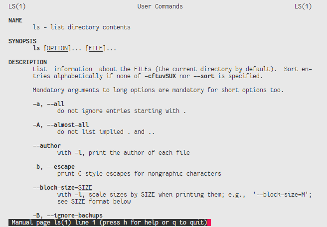

Parfois, ces pages de manuel ne fournissent pas d'exemple d'utilisation d'une commande. Il existe une base de données communautaire pour cela, [tldr.sh](https://tldr.sh/).

Pour vous aider à démarrer, voici une liste des commandes que vous allez devoir utiliser : `base64`, `cat`, `cd`, `cp`, `diff`, `du`, `echo`, `find`, `grep`, `ls`, `mkdir`, `mv`, `pwd`, `rm`, `sort`, `tar`, `touch`, `uniq`, `wc`.

1. Quel est votre nom d'utilisateur ? Affichez la valeur de la variable d'environnement `$USER`.
2. Identifiez le répertoire dans lequel vous vous situez au démarrage de votre shell.
3. Trouvez le chemin du fichier `os-release` dans l'arborescence. Combien de fichiers trouvez-vous ? Quelle différence y a-t-il entre eux ? Affichez leur contenu.
4. Déplacez-vous à la racine de l'arborescence en utilisant son chemin *relatif* : à partir de tout répertoire, `.` désigne le chemin courant, et `..` désigne le répertoire parent. Comment auriez-vous fait pour vous déplacer à la racine par chemin *absolu* ?
5. Affichez les fichiers et répertoires à la racine. Si certains sont cachés, ils doivent apparaître dans la sortie de votre commande. Reconnaissez-vous la [hiérarchie standard](https://en.wikipedia.org/wiki/Filesystem_Hierarchy_Standard#Directory_structure) d'un système de fichiers Unix ? Quelles différences pouvez-vous identifier ?
6. Déplacez-vous dans votre répertoire utilisateur (*home*, en anglais). Pour cela, utilisez la variable d'environnement `$HOME`.
7. Créez un répertoire `exercices` dans votre *home*.
8. Déplacez-vous dans ce répertoire.
9. Créez un fichier `exercices.txt`.
10. Dans ce fichier, sans utiliser d'éditeur de texte ([indice](https://en.wikipedia.org/wiki/Here_document) : vous allez utiliser une redirection), écrivez les [pangrammes](https://fr.wikipedia.org/wiki/Pangramme) suivant :

    > The quick brown fox jumps over the lazy dog.  
    > Waltz, bad nymph, for quick jigs vex.  
    > Glib jocks quiz nymph to vex dwarf.  
    > Sphinx of black quartz, judge my vow.  
    > Sphinx of black quartz, judge my vow.  
    > How vexingly quick daft zebras jump!  
    > The five boxing wizards jump quickly.  
    > Jackdaws love my big sphinx of quartz.  

11. Ajoutez la ligne suivante au fichier :

    > Pack my box with five dozen liquor jugs.

12. Affichez le contenu du fichier.
13. Comptez le nombre de pangrammes que contient le fichier.
14. Comptez le nombre d'occurrences du mot `quick` ([indice](https://en.wikipedia.org/wiki/Pipeline_(Unix)) : vous allez chaîner deux commandes). Attention, `quickly` ne doit pas être compté !
15. Un pangramme apparaît en double dans le fichier. Dans une même commande, triez les pangrammes par ordre alphabétique (sur leur première lettre), débarrassez-vous du doublon, et écrivez le résultat dans un nouveau fichier `pangrammes.txt`.
16. Affichez les différences entre `exercices.txt` et `pangrammes.txt`. Redirigez le résumé de ces différences dans un fichier `diff.txt`.
17. Supprimez le fichier `exercices.txt`. Renommez le fichier `pangrammes.txt` en `td0.txt`.
18. Le texte suivant est codé. Trouvez comment lui redonner sens. La sortie de la commande sera sauvegardée dans un fichier `decode.txt` :

    > TmV2ZXIgZ29ubmEgZ2l2ZSB5b3UgdXAKTmV2ZXIgZ29ubmEgbGV0IHlvdSBkb3duCk5ldmVyIGdv  
    > bm5hIHJ1biBhcm91bmQgYW5kIGRlc2VydCB5b3UKTmV2ZXIgZ29ubmEgbWFrZSB5b3UgY3J5Ck5l  
    > dmVyIGdvbm5hIHNheSBnb29kYnllCk5ldmVyIGdvbm5hIHRlbGwgYSBsaWUgYW5kIGh1cnQgeW91  
    > Cg==

19. Copiez votre répertoire `exercices` et donnez-lui le nom `td0`.
20. Créez une archive `td0.tar` contenant votre répertoire `td0`.
21. Combien d'octets pèse cette archive ? Combien d'octets pèse le répertoire `td0` ?
22. Une fois l'archive créée, supprimez le répertoire `exercices`. **Attention** : relisez bien votre commande avant de l'exécuter, car il n'y a pas d'annulation possible.

## TD1 : installation du système

### Objectifs

Ce premier TD ne concerne pas l'installation d'une distribution Linux "de bureau" que vous utiliseriez au quotidien sur votre machine. Notre cours adresse la question de l'*administration* d'un système Linux : nous allons mettre en place une machine virtuelle (VM, pour *Virtual Machine*) Linux qui fera office de *serveur*.


[Alexis Lê-Quôc](https://commons.wikimedia.org/wiki/File:Half_filled_server_racks.jpg)

Sur la photo ci-dessus, on voit une baie de serveurs en cours de montage. Les machines sont disposées ainsi dans un souci de minimiser leur encombrement et de faciliter leur refroidissement. On s'imagine mal devoir brancher claviers et écrans en cas d'intervention ! Pour cela, on accède au système *à distance*, grâce à un protocole célèbre : SSH (pour *Secure Shell*).

Vous accéderez donc toujours via SSH à la machine virtuelle que vous allez déployer.

### Déroulé

#### Installation de VirtualBox

Créer des machines virtuelles, c'est virtualiser les ressources physiques du système hôte, pour les partager entre des systèmes invités. Ce type de virtualisation est assisté par le matériel, qui fournit les fonctionnalités d'isolation requises pour assurer l'étanchéité entre les VM.

Cela permet de faire fonctionner, sur une même machine (l'hôte), de nombreux systèmes d'exploitation (invités) complets et hétérogènes, de manière indépendante, sur des ressources matérielles partagées.

Du point de vue d'une machine virtuelle, son environnement d'exécution est perçu comme une plateforme à part entière -- alors qu'il est en réalité un sous-ensemble des ressources matérielles de la plateforme hôte. Ce sous-ensemble est créé et géré par un *hyperviseur* (ou *VMM*, pour *Virtual Machine Manager*), un logiciel de bas niveau qui peut être exécuté en tant que système d'exploitation, ou comme un processus géré par le système d'exploitation hôte.

L'hyperviseur a pour responsabilité la gestion du cycle de vie des machines virtuelles : création, exécution, destruction et parfois migration des VM sont assurées par l'hyperviseur.

Il existe deux abstractions pour un hyperviseur :

* Type-1 (*bare-metal hypervisors*) : ces hyperviseurs fonctionnent à même le matériel de la machine hôte, sans l'intervention d'un système d'exploitation -- on peut considérer qu'ils sont eux-mêmes une forme de système d'exploitation. L'absence d'OS hôte entre le matériel et l'hyperviseur garantit une sécurité supérieure (la surface d'attaque est réduite) et de meilleures performances (moins d'indirection). Parmi les hyperviseurs type-1 de référence, on trouve VMware ESXi, KVM, Xen ou Hyper-V ;
* Type-2 (*hosted hypervisors*) : ces hyperviseurs s'exécutent en tant que processus d'un système d'exploitation hôte tel que Linux ou Windows. Ce sont des produits dédiés aux consommateurs finaux (nous !), qui leur permettent de manipuler des systèmes d'exploitation hétérogènes sur une même machine hôte. Les plus célèbres sont QEMU et VirtualBox.

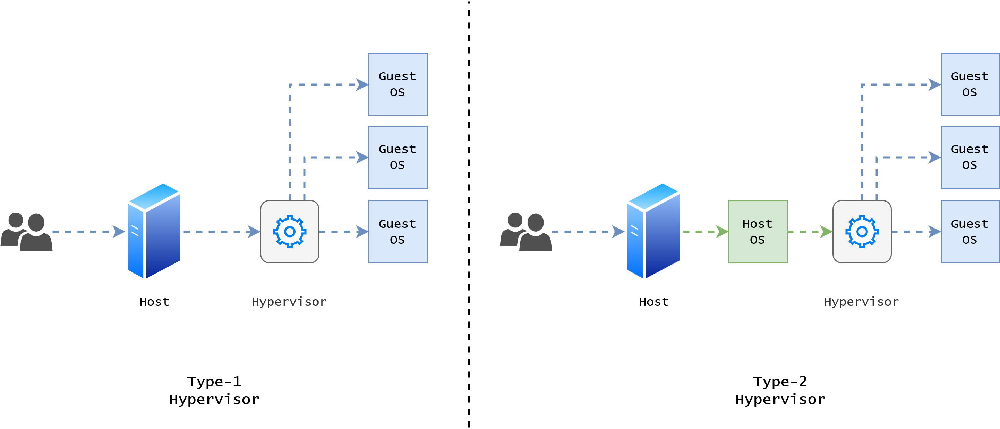

1. Installez [VirtualBox](https://www.virtualbox.org/wiki/Downloads) : choisissez le *Platform package* adapté à votre système hôte.

#### Création de la VM

Deux notions sont importantes pour cette étape :

* Image disque : un fichier, souvent d'extension `.iso` ou `.img`, qui représente un média amorçable (*bootable*) que l'on pourrait copier sur un disque flash par exemple. Il contient un chargeur d'amorçage et un système d'exploitation. Ces images disques sont utilisées pour installer un nouvel OS sur une machine, physique ou virtuelle ;
* Disque virtuel : un fichier, souvent d'extension `.vdi`, qui représente le disque d'amorçage d'un système d'exploitation.

1. Téléchargez une image disque de [Ubuntu Server](https://ubuntu.com/download/server).

2. Dans la fenêtre principale de VirtualBox, cliquez sur le bouton "Nouvelle" et suivez le guide :
    * 2048 Mo de mémoire vive devraient suffire ;
    * Choisissez de créer un *disque dur virtuel*, de type **VDI**, dynamiquement alloué avec une taille de départ de 10 Go.

3. Démarrez votre VM fraîchement créée. VirtualBox va vous demander de choisir un *disque de démarrage*. Ajoutez l'image disque que vous avez téléchargée, `ubuntu-22.04.1-live-server-amd64.iso`.

4. Si tout s'est bien passé, voici l'écran que vous devriez voir s'afficher :

    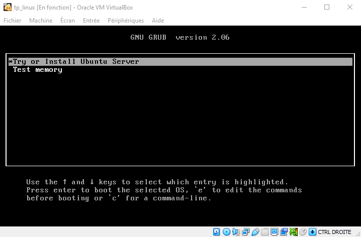

C'est le chargeur d'armoçage, *GRUB*. Vous pouvez valider le choix *Try or Install Ubuntu Server* et poursuivre le démarrage de l'OS.

#### Installation d'Ubuntu Server

Vous allez pouvoir vous lancer dans l'installation du système à proprement parler. Un assistant va vous guider tout au long de la procédure : vous pouvez utiliser les flèches du clavier et la touche de tabulation <kbd>↹</kbd> pour naviguer entre les boutons et les écrans.

1. Choisissez la langue et la disposition du clavier de votre choix. Si vous utilisez un clavier Azerty, la disposition à choisir est "French".

2. Le type d'installation à sélectionner est *Ubuntu Server (**minimized**)* :

    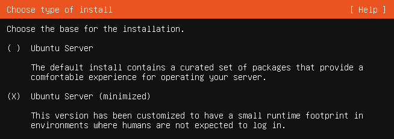

3. La connexion au réseau devrait s'effectuer d'elle-même. Vous n'avez pas besoin de préciser d'adresse de proxy. L'adresse du miroir d'archive Ubuntu est correcte par défaut.

4. Vous arrivez à l'étape de configuration du stockage. Sélectionnez "Custom storage layout" :

    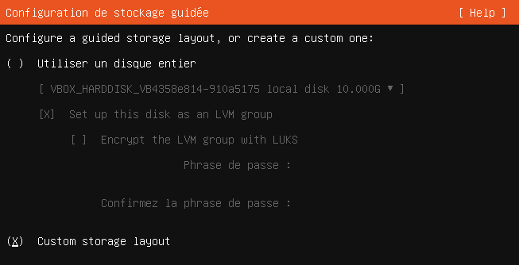

##### Partitionnement

1. Créez deux partitions : une pour la racine du système de fichiers, et une pour les répertoires utilisateur. Chacune prendra la moitié de l'espace disque total. Formatez-les avec le système de fichiers `ext4`.

    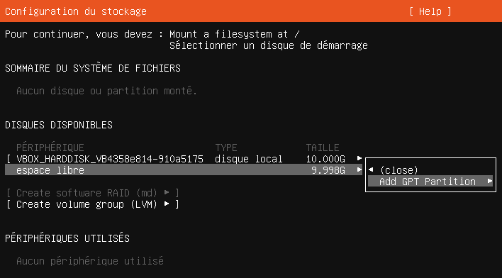

2. Faîtes une capture d'écran du schéma de partitionnement final et ajoutez-la à votre compte-rendu.

🔎 À votre avis, à quoi sert de partitionner le disque sur lequel on installe un système ? En un court paragraphe, proposez une réponse dans votre compte-rendu.

##### Serveur SSH

L'assistant d'installation vous demandera ensuite des informations sur votre profil et le nom de la machine.

À l'étape suivante, on vous propose d'installer le serveur OpenSSH. C'est ce service qui vous permettra d'accéder à distance à votre machine.

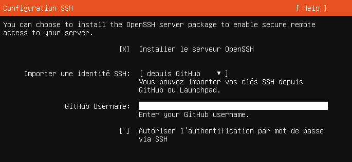

Si vous avez déjà un jeu de clefs SSH, vous pouvez les importer. Sinon, vous vous connecterez avec votre identifiant et votre mot de passe.

🔎 Qu'est-ce que sont ces clefs ? À quoi servent-elles ? En un court paragraphe, proposez une réponse dans votre compte-rendu.

##### Finalisation

La dernière étape vous propose une liste de paquets suggérés : n'en sélectionnez aucun et poursuivez jusqu'à la fin de l'installation d'Ubuntu.

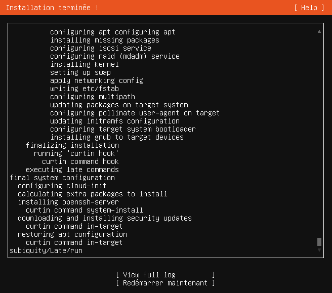

Lorsque c'est fini, vous pouvez choisir de "Redémarrer maintenant".

## TD2 : configuration d'un serveur Linux

### Objectifs

Cette seconde partie va nous permettre d'aborder les questions de réseau et de services.

À l'issue de ce TD, vous aurez configuré un accès distant à votre machine virtuelle. Votre système hébergera un serveur web.

### Déroulé

#### Réseau virtuel et règles du pare-feu

Pour accéder à votre machine virtuelle *via* son serveur SSH, il vous faut un... client SSH.

SSH est un ensemble de logiciels qui fonctionnent selon le modèle *client/serveur* :
* sur la machine distante (ici, votre VM), un *serveur* SSH est démarré, en attente d'une connexion. On dit qu'il *écoute* sur une **adresse**, à un **port** donné ;
* sur la machine locale (ici, votre système hôte), un *client* SSH contacte la machine distante de la manière suivante :

```bash
ssh -p 22 utilisateur@10.0.0.1
```

On spécifie l'adresse du serveur SSH (ici, `10.0.0.1`) et le port sur lequel il écoute (ici, `22`, le port par défaut pour SSH). Linux est un système multi-utilisateurs, on spécifie donc l'identifiant avec lequel on souhaite se connecter.

Votre machine distante est connectée à un réseau virtuel géré par VirtualBox. Entre votre système hôte et votre VM, on trouve un pare-feu qui filtre les connexions entrantes :

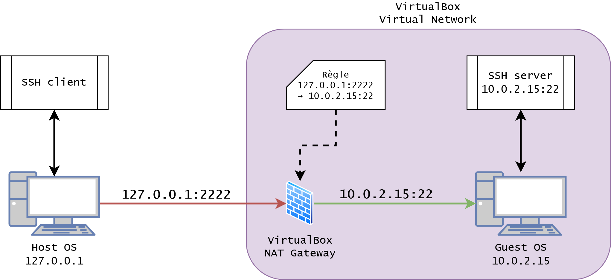

Nous allons créer une *règle* dans ce pare-feu pour autoriser les connexions au serveur SSH de votre VM :

1. Depuis l'accueil de VirtualBox, faîtes un clic droit sur votre VM et cliquez sur "Configuration".
2. Ouvrez l'onglet "Réseau". Chaque VM peut avoir jusqu'à quatre interfaces réseau. Seule la première nous intéresse ici.
3. Déroulez les paramètres avancés et cliquez sur "Redirection de ports". Créez la règle suivante :

    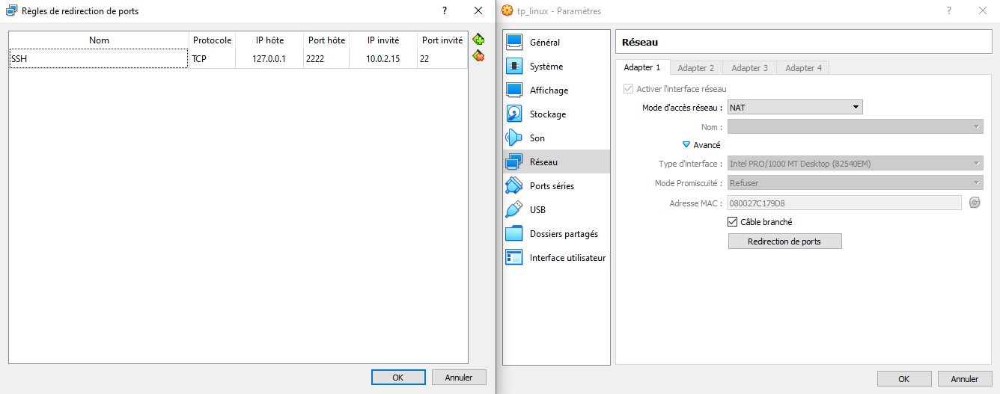

#### Connexion SSH à la VM depuis votre système hôte

Puisque les étapes suivantes du projet consistent à développer des scripts Bash, nous allons utiliser un IDE (*Integrated Development Environment*) livré avec un terminal et un client SSH.

1. Si vous ne l'avez pas déjà installé, [Visual Studio Code](https://code.visualstudio.com/) est un excellent IDE, développé par Microsoft. Récupérez VSCode et exécutez-le sur votre machine.

2. VSCode est un IDE *modulaire* : cela signifie que de nombreuses fonctionnalités sont accessibles via l'installation d'*extensions*. Microsoft propose une extension *Remote - SSH* qui permet de se connecter à une machine *via* SSH pour y travailler à distance. Installez l'extension :

    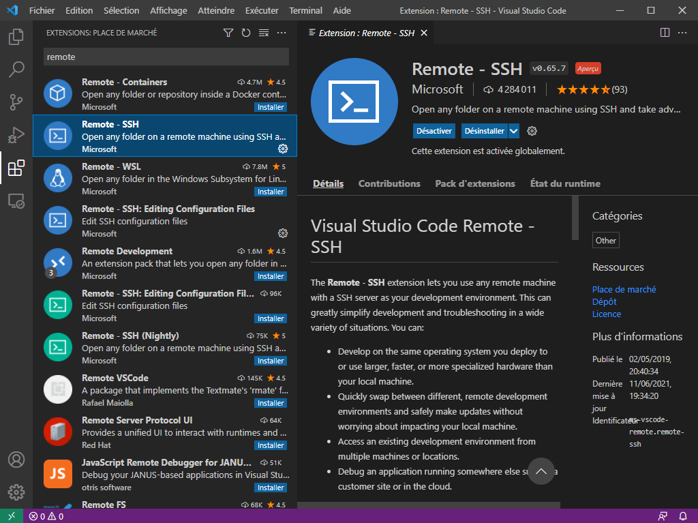

3. Connectez-vous à votre machine virtuelle :

    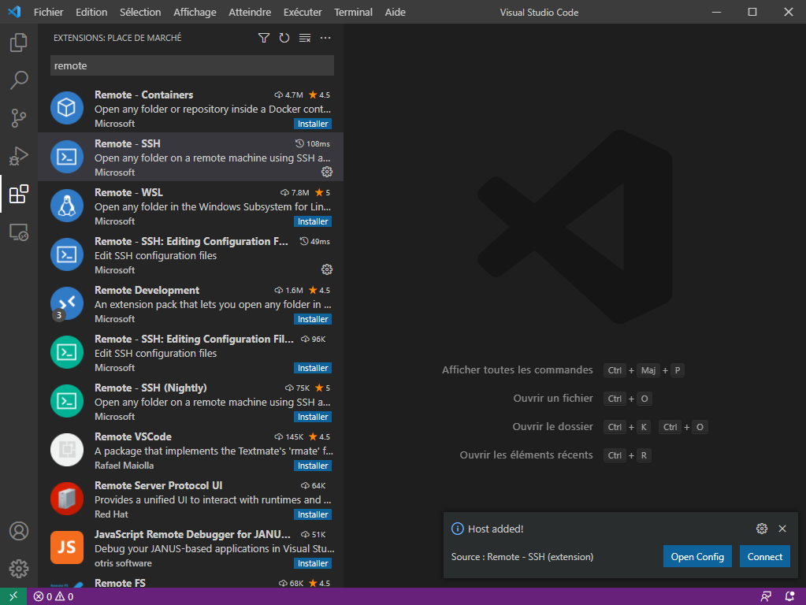

4. Rentrez le mot de passe de votre utilisateur :

    

5. Créez un répertoire pour vos travaux grâce au terminal (s'il n'est pas ouvert par défaut, passez par le menu : *Terminal > Nouveau terminal*). Ouvrez ce répertoire dans VSCode pour commencer à travailler :

    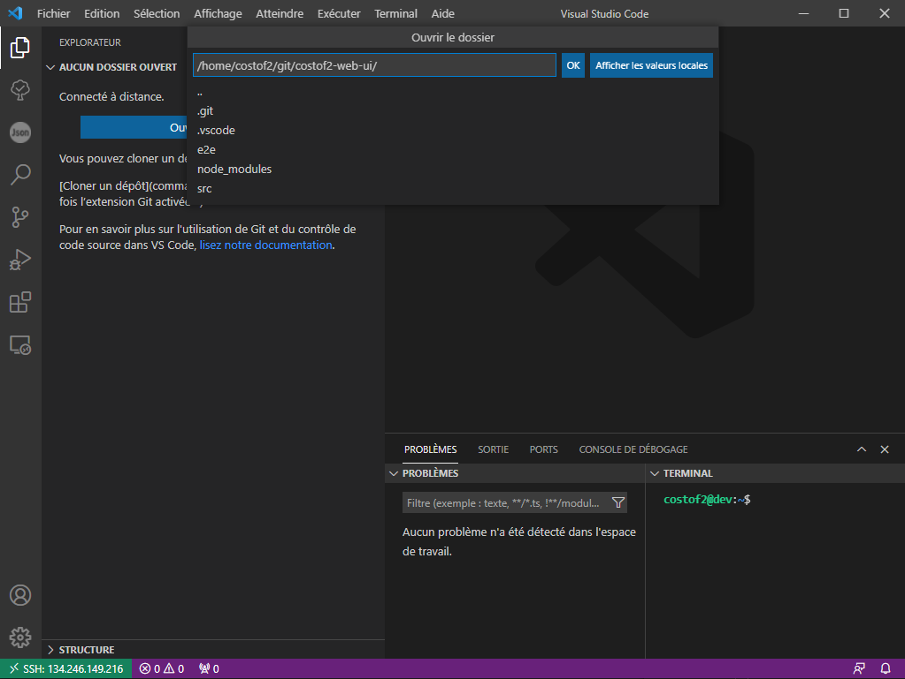

#### Gestion des paquets logiciels sous Ubuntu

La plupart des distributions Linux reposent sur un système de *paquets* pour l'installation de logiciels. Un paquet est une archive qui contient :
* les fichiers nécessaires à l'exécution d'un logiciel (c'est-à-dire le binaire de l'application) ;
* les métadonnées nécessaires à l'exécution d'un logiciel (notamment sa liste de *dépendances*, c'est-à-dire les paquets supplémentaires indispensables à son bon fonctionnement, comme des bibliothèques par exemple) ;
* la documentation du logiciel ;
* éventuellement le code source du logiciel (paquets nommés avec le suffixe `-dev` sous Ubuntu).

Le système de paquets utilisé par Ubuntu est dérivé de celui de [Debian](https://www.debian.org/), la distribution "mère" d'Ubuntu. Cela explique l'extension des paquets Ubuntu, `.deb`.

Vous interagirez rarement avec un paquet `.deb`. La plupart du temps, on utilise un *gestionnaire de paquets* pour travailler dans les *dépôts logiciels* de sa distribution. Ubuntu est livrée avec *APT* (pour *Advanced Packaging Tool*). APT est capable de lire l'index des paquets pour chercher, installer, mettre à jour ou supprimer un logiciel *et ses dépendances* -- c'est la force d'un gestionnaire de paquets, qui automatise ces processus parfois fastidieux.

Pour installer un paquet sur votre système, il faudra agir avec les droits **superutilisateur**. Sous Ubuntu, le compte `root` est désactivé par défaut, vous ne pourrez donc pas utiliser `su` pour vous connecter en tant que superutilisateur.

Toutefois, l'utilisateur que vous avez créé lors de l'installation a la permission d'élever ses privilèges le temps de l'exécution d'une commande. Pour cela, on préfixe la commande que l'on souhaite passer par `sudo`. Commencez par mettre à jour l'index des paquets avec `apt` :

```bash
sudo apt update
```

##### Installation d'un paquet

Nous allons déployer un serveur web sur la VM en utilisant le gestionnaire de paquets.

Un serveur web est un logiciel qui permet de servir du contenu *via* le protocole HTTP.

Tout comme OpenSSH, Nginx est considéré par Ubuntu comme un [*service*](https://doc.ubuntu-fr.org/services). Sous Ubuntu, les services sous gérés par `systemd`. Pour interagir avec les services du système, on utilise la commande [`systemctl`](https://manpages.ubuntu.com/manpages/xenial/en/man1/systemctl.1.html).

1. En vous appuyant sur [la documentation](https://ubuntu.com/server/docs/package-management), utilisez `apt` pour installer le serveur web [`nginx`](https://www.nginx.com/).
2. Dans l'arborescence de votre VM Ubuntu, où se situe le répertoire de configuration de `nginx` ? TODO: expliquez rapidement le rôle des répertoires et fichiers qui s'y trouvent.
3. Parcourez la configuration par défaut. Sur quelle adresse écoute le serveur web ? Quel est le port HTTP par défaut ?
4. Comment vérifier l'état du serveur web ?
5. Comment stopper ou démarrer `nginx` ?
6. Ouvrez le port associé au serveur web dans la table NAT de VirtualBox.
7. Comment pouvez-vous accéder aux pages servies par `nginx` depuis votre système hôte ?
8. Modifiez le contenu de la page par défaut et vérifiez le résultat.

#### Surveillance des journaux système

L'un des rôles clefs de l'administrateur système consiste à *superviser* le système dont il est en charge.

Linux fournit un mécanisme de [journaux](https://ubuntu.com/tutorials/viewing-and-monitoring-log-files), fichiers texte qui centralisent les informations remontées par les services du système.

1. Installez `logwatch`.
2. Configurez `logwatch` pour remonter les journaux de `nginx`.

## TD3 : introduction à l'automatisation

### Objectifs

TODO: Script shell...

TODO: Création de backups...

TODO: Extraction de backups...

TODO: chown, chmod...

### Déroulé

1. TODO: VSCode remote + shellcheck

🔎 Lorsque `shellcheck` vous remonte un avertissement ou une erreur, reportez-le dans votre compte rendu et expliquez comment vous l'avez traité et résolu.

## TD4 : développement d'un script d'administration

### Objectifs

#### Fonctionnalités attendues

#### Qualité du code

Un script shell est potentiellement dangereux : certaines commandes produisent des effets de bord 

Notions importantes :
* idempotence ;
* ...

Vous utiliserez un squelette de [script Bash sans danger](https://gist.github.com/m-radzikowski/53e0b39e9a59a1518990e76c2bff8038). L'auteur de ce squelette donne de nombreuses informations et détaille sa mise en œuvre dans un [article](https://betterdev.blog/minimal-safe-bash-script-template/) qu'il est recommandé de lire de son intégralité avant de démarrer.
