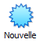

# Introduction à l'administration Linux
{: .no_toc }

1. TOC
{:toc}

## Objectifs

Ce cours est l'occasion de vous initier au fonctionnement d'un système GNU/Linux et à son administration.

À l'issue du mini-projet, vous serez capable d'installer et configurer un serveur Linux. Vous aurez connaissance des tâches de base qui incombent aux administrateurs système, et pourrez en automatiser une partie : vous connaîtrez le langage du shell Bash et sa mise en œuvre dans un script exécutable.

## Prérequis

Aucun, ou presque ! Quelques ressources pourront vous aider au cours du projet :

* La documentation en français pour [un serveur sous Ubuntu](https://doc.ubuntu-fr.org/serveur). Certaines informations peuvent être un peu datées, mais elle a le mérite de couvrir un large éventail de sujets ;
* Le [Ubuntu Server Guide](https://ubuntu.com/server/docs), en anglais, est écrit par Canonical, la société éditrice d'Ubuntu. N'hésitez pas à vous y référer, elle est à jour et très complète ;
* Le livre de Vincent Lozano, [*Tout ce que vous avez toujours voulu savoir Unix sans jamais oser le demander*](http://lozzone.free.fr/unix/guide-unix.pdf), est un manuel pour débutants très complet.

## Évaluation

Vous restituerez ce mini-projet en produisant une archive contenant tous les fichiers que vous jugerez utile de fournir, ainsi qu'un compte-rendu comportant vos réponses aux questions qui seront posées tout au long du sujet, et toute remarque ou commentaire que vous souhaiteriez ajouter.

## TD1 : installation du système

### Objectifs

Ce premier TD ne concerne pas l'installation d'une distribution Linux "de bureau" que vous utiliseriez au quotidien sur votre machine. Notre cours adresse la question de l'*administration* d'un système Linux : nous allons mettre en place une machine virtuelle (VM, pour *Virtual Machine*) Linux qui fera office de *serveur*.

[Alexis Lê-Quôc](https://commons.wikimedia.org/wiki/File:Half_filled_server_racks.jpg)

Sur la photo ci-dessus, on voit une baie de serveurs en cours de montage. Les machines sont disposées ainsi dans un souci de minimiser leur encombrement et de faciliter leur refroidissement. On s'imagine mal devoir brancher claviers et écrans en cas d'intervention ! Pour cela, on accède au système *à distance*, grâce à un protocole célèbre : SSH (pour *Secure Shell*).

Vous accéderez donc toujours via SSH à la machine virtuelle que vous allez déployer.

### Déroulé

#### Installation de VirtualBox

TODO: VM, VirtualBox...

0. Installez [VirtualBox](https://www.virtualbox.org/wiki/Downloads) :
    * *Platform package*: ... ;
    * *VirtualBox Extension Pack*: ... ;

#### Création de la VM

TODO: image disque, disque virtuel...

0. Téléchargez une image disque de [Ubuntu Server](https://ubuntu.com/download/server) :
    * ...

1. Dans la fenêtre principale de VirtualBox, cliquez sur le bouton  et suivez le guide :
    * 2048 Mo de mémoire vive devraient suffire ;
    * Choisissez de créer un *disque dur virtuel*, de type **VDI**, dynamiquement alloué avec une taille de départ de 10 Go.

2. Démarrez votre VM fraîchement créée. VirtualBox va vous demander de choisir un *disque de démarrage*. Ajoutez l'image disque que vous avez téléchargée, `ubuntu-22.04.1-live-server-amd64.iso`.

3. Si tout s'est bien passé, voici l'écran que vous devriez voir s'afficher :

C'est le chargeur d'armoçage, *GRUB*. Vous pouvez valider le choix *Try or Install Ubuntu Server* et poursuivre le démarrage de l'OS.

#### Installation de la VM

Vous allez pouvoir vous lancer dans l'installation du système à proprement parler. Un assistant va vous guider tout au long de la procédure : vous pouvez utiliser les flèches du clavier et la touche de tabulation <kbd>↹</kbd> pour naviguer entre les boutons et les écrans.

1. Choisissez la langue et la disposition du clavier de votre choix. Si vous utilisez un clavier Azerty, la disposition à choisir est "French".

2. Le type d'installation à sélectionner est *Ubuntu Server (**minimized**)* :

3. La connexion au réseau devrait s'effectuer d'elle-même. Vous n'avez pas besoin de préciser d'adresse de proxy. L'adresse du miroir d'archive Ubuntu est correcte par défaut.

4. Vous arrivez à l'étape de configuration du stockage. Sélectionnez "Custom storage layout" :

##### Partitionnement

1. Créez deux partitions : une pour la racine du système de fichiers, et une pour les répertoires utilisateur. Chacune prendra la moitié de l'espace disque total. Formatez-les avec le système de fichiers `ext4`.

2. Faîtes une capture d'écran du schéma de partitionnement final et ajoutez-la à votre compte-rendu.

À votre avis, à quoi sert de partitionner le disque sur lequel on installe un système ? En un court paragraphe, proposez une réponse dans votre compte-rendu.

##### Serveur SSH

L'assistant d'installation vous demandera ensuite des informations sur votre profil et le nom de la machine.

À l'étape suivante, on vous propose d'installer le serveur OpenSSH. C'est ce service qui vous permettra d'accéder à distance à votre machine.

Si vous avez déjà un jeu de clefs SSH, vous pouvez les importer. Sinon, vous vous connecterez avec votre identifiant et votre mot de passe.

Qu'est-ce que sont ces clefs ? À quoi servent-elles ? En un court paragraphe, proposez une réponse dans votre compte-rendu.

##### Finalisation

La dernière étape vous propose une liste de paquets suggérés : n'en sélectionnez aucun et poursuivez jusqu'à la fin de l'installation d'Ubuntu.

Lorsque c'est fini, vous pouvez choisir de "Redémarrer maintenant".

## TD2 : configuration d'un serveur Linux

### Objectifs

### Déroulé

* serveur SSH
  * NAT
* contrôle à distance

## TD3 : introduction à l'automatisation

### Objectifs

### Déroulé

* VSCode remote + shellcheck
* backups (script shell)

## TD4 : développement d'un script d'administration

* https://unix.stackexchange.com/questions/4899/var-vs-var-and-to-quote-or-not-to-quote

* Utiliser un template pour un [script Bash sans danger](https://gist.github.com/m-radzikowski/53e0b39e9a59a1518990e76c2bff8038)
* Lire l'article du créateur du script https://betterdev.blog/minimal-safe-bash-script-template/

